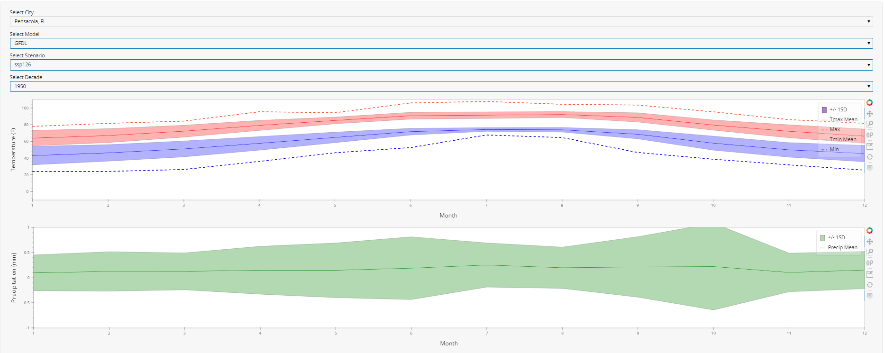
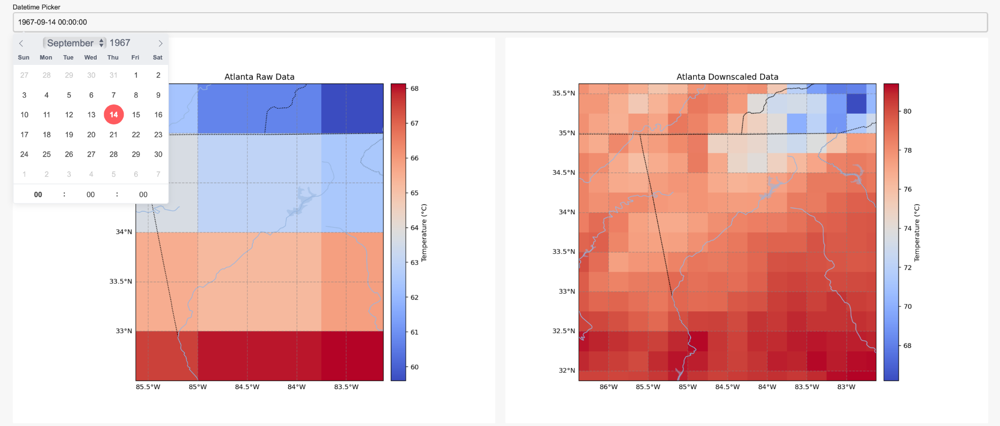
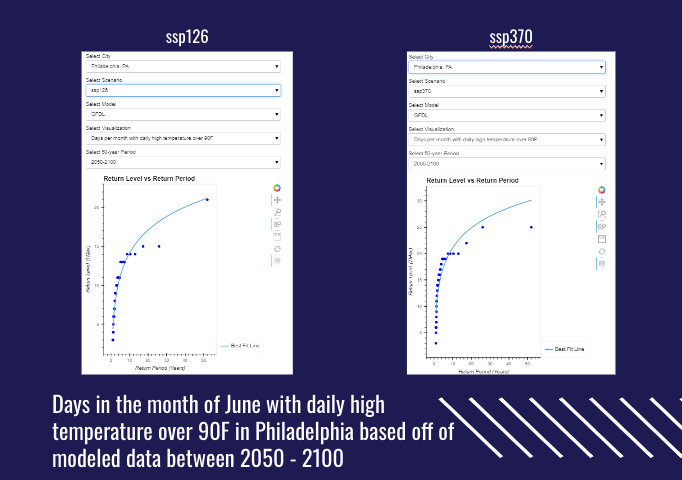

# EPRI Climate Data Visualization Project

## General Overview
This project was carried out for the Electric Power Research Institute (EPRI), a leading research organization dedicated to advancing the reliable, affordable, and resilient future of energy. EPRI is known for its unbiased, science-driven approach, rigorously focusing on objective research to guide the energy industry without advocating for specific companies, sectors, or technologies. The overarching goal of EPRI is to deliver independent thought leadership and practical insights that benefit society at large, empowering the energy sector through collaborative and data-driven solutions.

The project was conducted by DataStory, a data science organization at UC Berkeley. My role on this project was Project Manager. I had the opportunity to not only contribute to the technical aspects of the project but also manage the team and lead communication with EPRI stakeholders.

## Project Overview
This project is somewhat of a continuation from our previous semester's contracted work with EPRI on creating interactive visualizations using historical and modeled climate data. (See this link for the previous project). This semester, the goal is to enable users to explore and analyze relevant climate trends across over 90 cities. We are generally focusing more on the future modeled data rather than most of the focus being on the historical data. For these datasets, we are generating interactive visualizations that the users can control. The visualizations give the users a better visual idea about the kind of climate change data that EPRI works with and uses in their research.

### Objectives:
- Create **interactive visualizations** to analyze climate data.
- Visualize **climate trends** for over 90 cities using historical and modeled data.
- Develop **interactive versions of EPRI’s static mockup figures** for more dynamic analysis.

## Packages and Libraries

### HoloViz Suite
We used the **HoloViz suite** of visualization tools, which includes:
- **HoloViews**: Simplifies the creation of complex visualizations.
- **hvPlot**: Combines Pandas data structures with HoloViews for easy plotting.
- **Panel**: Enables the creation of interactive dashboards by combining plots and widgets.
- **GeoViews**: Specializes in visualizing geographic data.

### Other Libraries:
- **Bokeh**: A powerful interactive visualization library, used for backend rendering of graphics and visualizations.
- **Cartopy**: A library for cartographic projections and geographic data, used for mapping.

## Visualization 1: Temperature & Precipitation Projections

**Deliverable**:  
An interactive plot that enables users to explore **temperature and precipitation levels** across cities, models, and emissions scenarios.

**Features**:
- Ability to select between different **cities**.
- Comparison of **forecasts from multiple models**.
- Explore different **forcing scenarios** (e.g., SSP126 vs. SSP370).

**Our Solution**:
- Utilized **Panel** to create interactive widgets.
- Used **HoloViews** and **hvPlot** for dynamic and light-weight plotting.
- Interactive line plots for mean temperature and area plots to represent the range of 1 standard deviation above and below the mean.
- Dotted lines for displaying **maximum** and **minimum temperatures**.
- 

## Visualization 2: Atlanta Temperature Projections: Raw vs. Downscaled Data

**Tool Used**:  
For this visualization, we utilized **Cartopy** to create dynamic maps, and interactive widgets via **Panel** to explore data in more detail.

**Data Presentation**:
- The visualization superimposes **heatmaps** to depict **temperature variations** across different regions of Atlanta.
- Users can toggle between raw and downscaled data.

**Purpose**:
- Highlights the **differences** between raw climate data and downscaled climate data.
- Demonstrates how **resolution** affects the accuracy of climate models, particularly in localized regions like Atlanta.

**Impact**:
- This visualization showcases the importance of using downscaled data for more **accurate local climate projections**.

## Visualization 3: Return Level vs. Return Period

A **return level vs. return period plot** visualizes the relationship between the magnitude of an event and the average time before the next event of similar magnitude or greater occurs.

**Example**:
- Visualizes days in June with temperatures exceeding 90°F in Philadelphia, based on **modeled data between 2050-2100**.
  
**Purpose**:
- This plot helps to analyze the frequency of extreme temperature events over time.
- Useful for understanding **climate extremes** and their likely recurrence.

---

## Reflection

This project provides users of EPRI's website with dynamic tools to explore climate data and understand projected trends across a variety of regions and models. The interactive nature of these visualizations allows for more nuanced analysis of future climate scenarios, offering deeper insights than traditional static plots.
